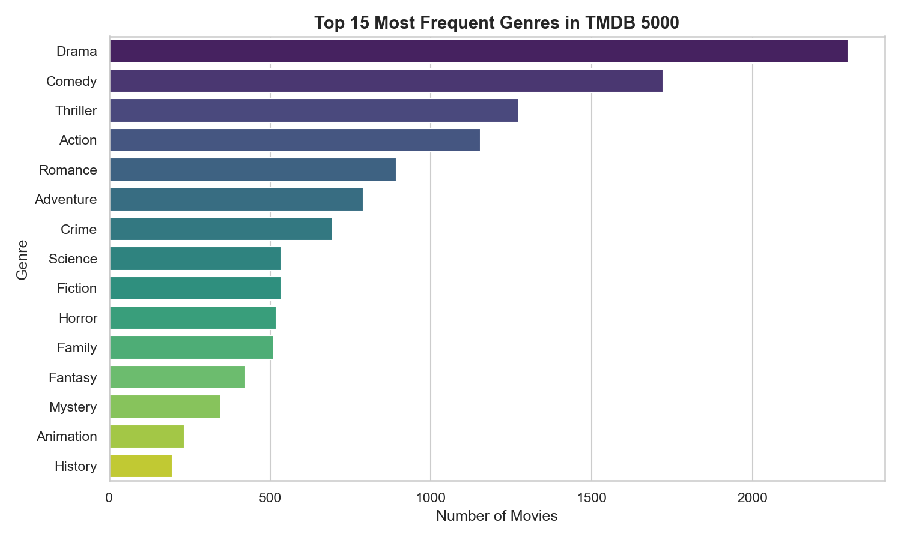

# ⚡ MoodFlix

**A Full-Stack ML-Powered Mood-Based Movie Recommendation Engine**



MoodFlix is a production-grade Web Application built to solve the "paradox of choice" on streaming platforms. Instead of making you blindly endlessly scroll through titles, MoodFlix allows you to select your **current mood** (e.g., Happy, Sad, Nostalgic), and utilizes purely mathematical Machine Learning models to instantly recommend the perfect movie.

---

## 🧠 Machine Learning Architecture

MoodFlix employs two parallel Machine Learning models operating on the **TMDB 5000 Movies Dataset**:

### 1. The Core Engine: Unsupervised NLP (TF-IDF & Cosine Similarity)
Instead of relying on simple genre sorts, MoodFlix vectorizes the raw text of 4,800 movie plotlines (`overviews`) and genres. By applying a **TF-IDF** (Term Frequency-Inverse Document Frequency) algorithm, it compresses the English language into an algebraic matrix. It then plots these movies in a 20,000-dimensional matrix, using **Cosine Similarity** density clustering to find the movies with the narrowest geometric angle (meaning their plots and themes are statistically identical). 

### 2. The Evaluator: Supervised Decision Tree Classifier
Every movie returned by the recommendation engine is instantly piped through a Supervised **Decision Tree Classifier** restricted to a `max_depth` of 5. Natively trained on runtime, rating averages, and `MultiLabelBinarized` genre arrays, this algorithm predicts whether the movie was a Box Office **Hit** (1) or **Flop** (0) based strictly on the mathematical median of the dataset, rendering a bright neon badge directly onto the React User Interface.

---

## 🏗️ Tech Stack

### Backend (Computation Layer)
- **Framework:** FastAPI / Uvicorn (Python 3.10+)
- **ML Libraries:** Scikit-Learn, Pandas, NumPy
- **Data Visualization:** Matplotlib, Seaborn
- **Integration:** TMDB API (httpx)

### Frontend (Client Layer)
- **Framework:** React 18, Vite, TypeScript
- **Styling:** TailwindCSS (Neo-Brutalist styling tokens)
- **Animations:** GSAP (GreenSock)

---

## 🚀 Local Installation

This project is built as a split-stack. To run it locally on your machine, you must run both the backend API and the frontend website simultaneously.

### 1. Start the Backend API
Open a terminal in the `backend/` directory:
```bash
cd backend
python -m venv venv
venv\Scripts\activate   # (Windows)
pip install -r requirements.txt
python -m uvicorn main:app --reload
```

### 2. Start the Frontend Website
Open a second terminal in the `frontend/` directory:
```bash
cd frontend
npm install
npm run dev
```
Navigate to `http://localhost:5173` in your browser.

---

## API Endpoints

| Method | Endpoint               | Body / Params                      | Response                                    |
|--------|------------------------|------------------------------------|---------------------------------------------|
| GET    | `/health`              | —                                  | `{ status, movies_loaded }`                 |
| GET    | `/api/moods`           | —                                  | `{ moods: string[] }`                       |
| POST   | `/api/recommend/mood`  | `{ "mood": "happy" }`             | `{ mood, genre, movies: MovieResult[] }`    |
| POST   | `/api/recommend/title` | `{ "title": "Avatar" }`           | `{ query, movies: MovieResult[] }`          |
| GET    | `/api/movies/search`   | `?q=avatar&limit=10`              | `{ results: [{ title, id }] }`             |

---

## 📊 Analytics & Visualizations
Instead of using disconnected Jupyter Notebooks, MoodFlix dynamically generates raw Pandas visualizations (Density Histograms, Clustered Heatmaps, TF-IDF Term Weights) and embeds them natively into the `"Behind the ML Engine"` gallery on the live website to physically prove the accuracy of its mathematical scaling schemas.

---

## ML Context & Extending the Model

This project extends the coursework from **CSE3231 — Machine Learning Lab** at **Manipal University Jaipur**:
- **CO4 (Regression/Similarity Models)** — Uses cosine similarity as a distance metric to rank movie relevance
- **CO5 (NLP)** — Applies TF-IDF vectorization to transform text (overviews + genres) into numerical representations

Ideas for future improvement:
1. **BERT Embeddings** — Replace TF-IDF with sentence-transformers for semantic understanding
2. **Collaborative Filtering** — Add user-user or item-item collaborative filtering using rating data
3. **User Feedback Loop** — Let users rate recommendations to fine-tune results

---
*Developed for CSE3231 Machine Learning Laboratory (2025-2026).*
